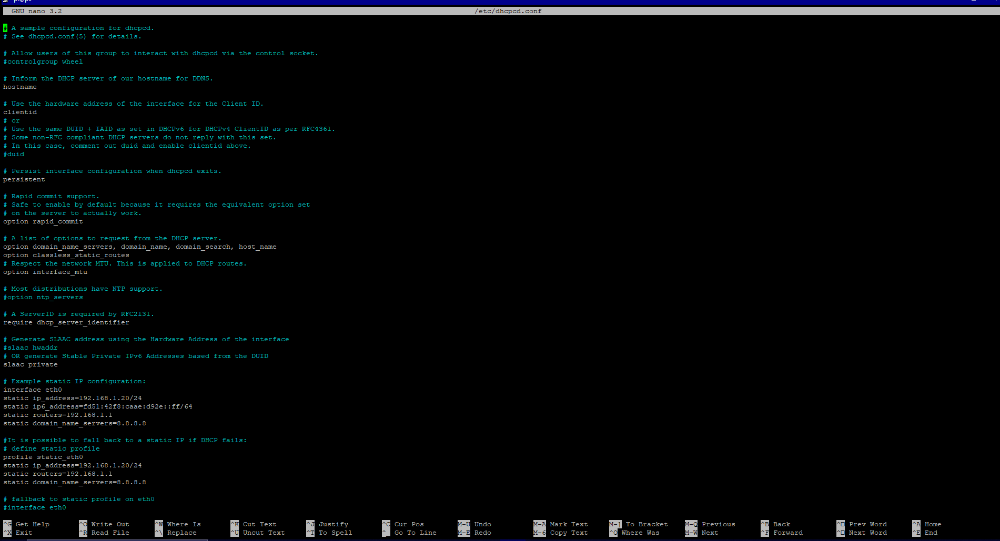
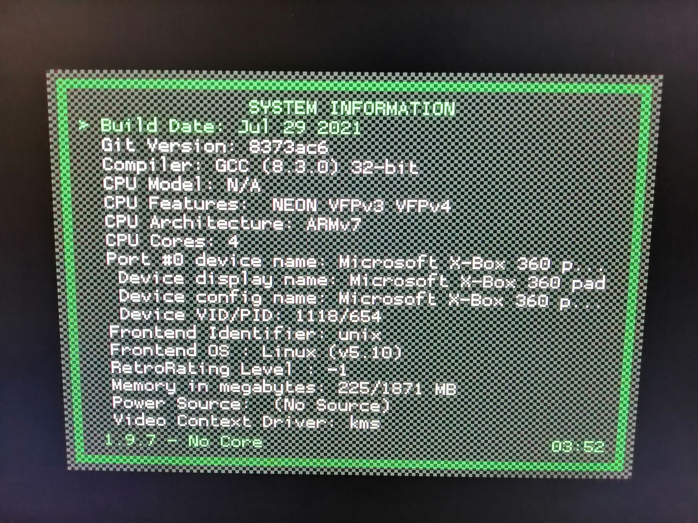
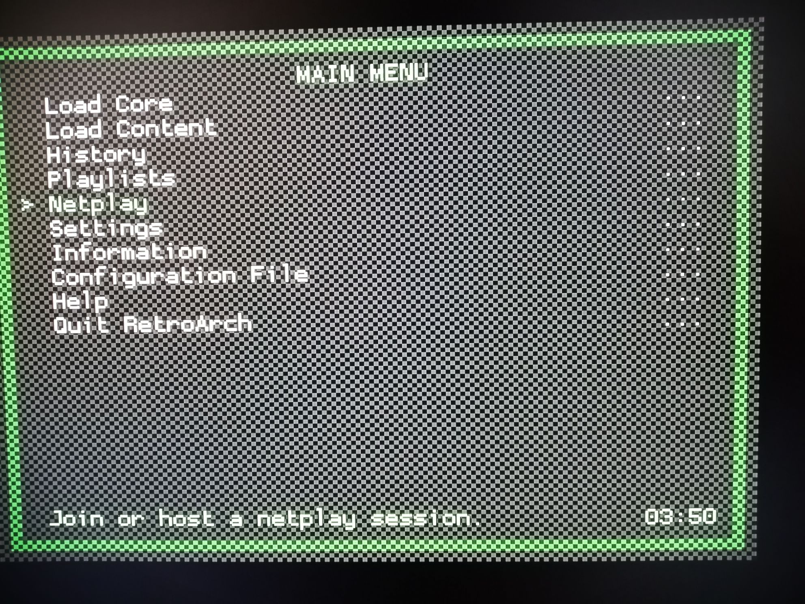
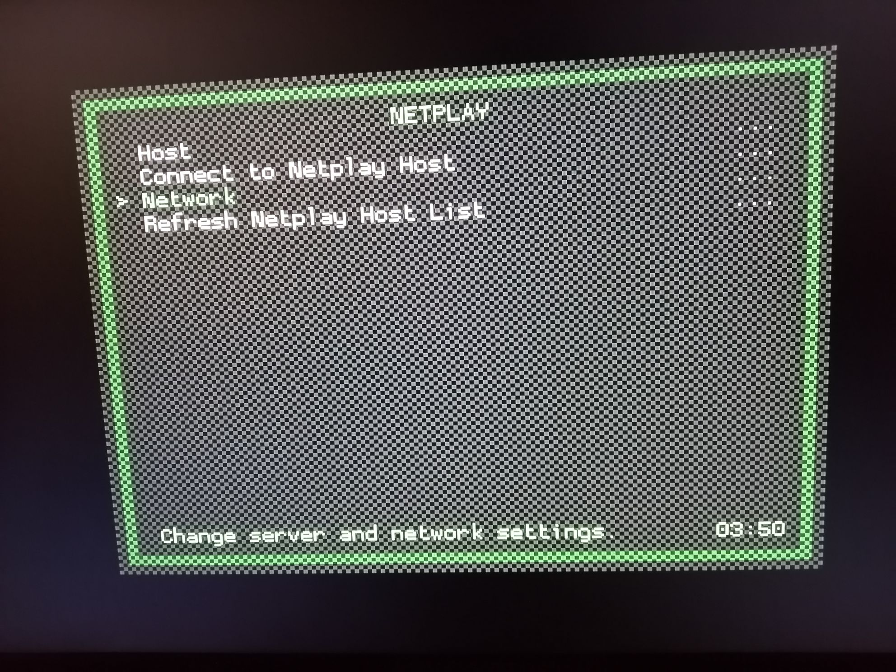
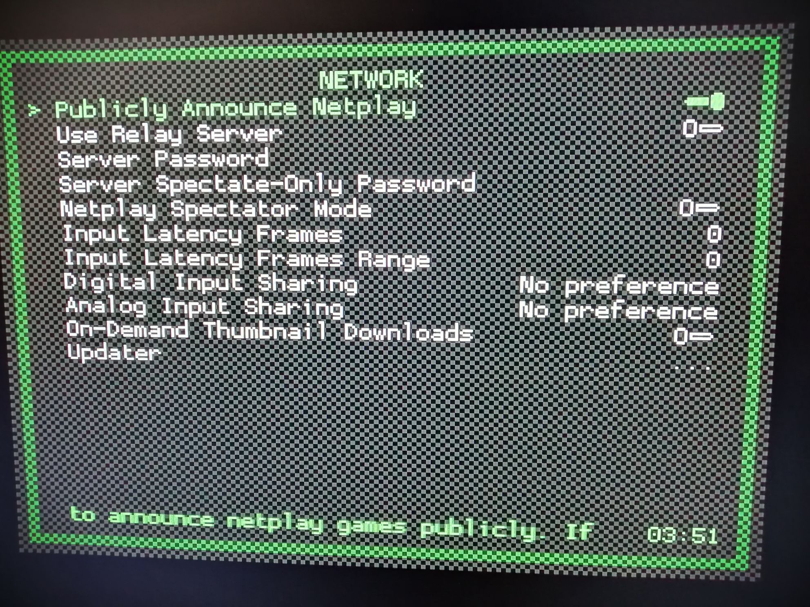

# Retr-o-Nline

INTRODUCCIÓN:
Los videojuegos han sido y sin duda serán la fuente principal de entretención para muchos y muchas a día de hoy. Pero estos no empezaron hace algunos poco años, sino que
llevan décadas desarrollándose y evolucionando constantemente desde a partir de los años 50 (aproximadamente) donde nació el primer videojuego conocido hasta la fecha.
Nuestro proyecto intenta juntar lo antiguo o mejor conocido como "retro" a lo moderno, haciendo que los videojuegos del pasado se puedan jugar de manera remota con tus
amigos todo esto gracias a la tecnología del presente.

MATERIALES:
/Rasperri pi 4 ; 2GB RAM
/Transformador ; 9.0V == 3A ; Conector USB tipo C
/Monitor o pantalla con entrada HDMI
/Teclado y control(opcional) con conección USB
/Trajeta microSD 16GB (mínimo recomendado)

TUTORIAL:

Bien, para comenzar con la preparación de nuestro proyecto, procederemos a instalar Retropie en nuestra Rasperri. Intalaremos el software mostrado a continuación y con la
trajeta microSD insertada en el dispositivo procederemos a "quemar" la tarjeta con la información de Retropie

Enlace:
https://www.raspberrypi.org/software/

Una vez que el proceso de instalación haya terminado, puede insertar la tarjeta en su rasperri y conectar esta ultima al monitor para comenzar a utilizarla.
Luego, debería permitir escribir codigos (de lo contrario, puede simplemente presionar la tecla F4) donde debe introducir el comando:

$sudo nano /etc/dhcpcd.conf

Despues de esto, debería aparacer una pantalla con las configuraciones de red. Asegurese de editarlas y hacer que luzcan como se ve en la imagen a continueción:

Luego de eso, asegurese de guardar los cambios y luego ingrese el comando: 

$sudo reboot

luego de esto la "consola" se reiniciará y los cambios a la red deberían haberse aplicado.
despues de esto incie Retropie normalmente y vaya a la seccion donde dice "Retroarch" y revise que todo luzca como se muestra en las imagenes

y despues de hacer esto dirijase al apartado de "Retroarch Netplay" y deje las configuraciones como se ve a continuación

